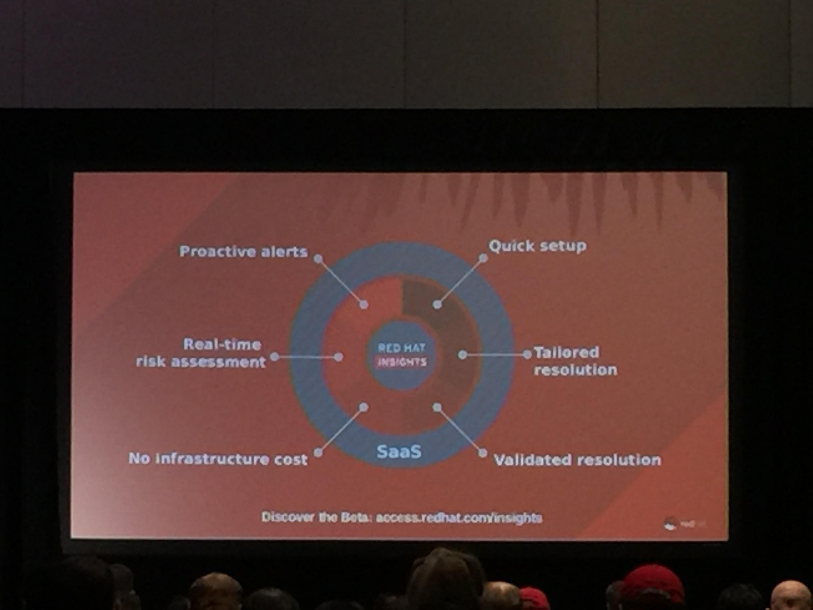

# How to Troubleshoot OpenStack Without Losing Sleep

## RabbitMQ

Too few RMQ file descriptors is a recipe for disaster

Set `rabbitmq-server` to `NOFILE limit to 65436*`

## Knowledge-Centered Support (KCS)


### Issue # 2
Random failure when spawning large amount of instances

100+ tasks, 1 or 2 failures per bulk deploy

```
nova list
ERROR (ConnectionRefused): Unable to esablish connection to keystone
```

Often keystone is not the culprit.  Seeing a lot of `CLOSE_WAITs`.

### Basic setup
HA 3 controller with Galera MariaDB + HAProxy with VIP for `nova-api` and `keystone`

Strangely HAProxy runs on each node

### Troubleshooting steps and ideas

This troubleshooting shows example where keystone fails with message above from `nova list`

1. Start with basic network troubleshooting
2. Check HAProxy load balancer
	1. 	end user -> nova
	2. nova -> keystone
	3. keystone -> database

Keep an eye on HAProxy logs to for `cD` client daemon sections

Possibly hit max connections for Galera, might need to set hight threshold.  Set to:

All this can be found on **slide 19** of this presentation.

```
galera: sessions
max: 2000 Limit: 2000

timeout connect 5s
timeout client 30s
timeout server 30s

# global
maxconn: 40000
```

### Could be system dependent (based on core count)

Example system on **slide 21**.  This shows what the connection count, workers and integer values can be for a multi-controller setup.

## Troubleshooting Workflow

See picture.  All steps are basically reactive due to discovered issue.  Consider scale of env, then work from there.

